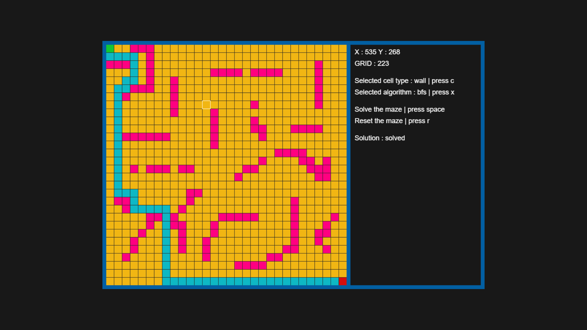

# Maze Solver

## Project Description

Maze Solver is an interactive web application that allows users to create and solve mazes. This application can solve mazes using different pathfinding algorithms (BFS, DFS, and A*) and visually demonstrate the solution process.

## Live Demo

The project can be viewed live at : [https://ahmetalperx.github.io/maze-solver](https://ahmetalperx.github.io/maze-solver)

## Screenshots

## Features

- Interactive maze creation
- Three different pathfinding algorithms: 
  - Breadth-First Search (BFS)
  - Depth-First Search (DFS)
  - A* Algorithm
- Real-time solution visualization
- Customizable start and end points

## Usage

1. Creating the maze:
   - Left-click to add or remove walls
   - Press 'C' to cycle through cell types (wall, path, start, end)

2. Selecting an algorithm:
   - Press 'X' to cycle through algorithms (BFS, DFS, A*)

3. Solving the maze:
   - Press the space bar to run the selected algorithm

4. Resetting:
   - Press 'R' to reset the maze

## File Structure

- `index.html`: Main Html file
- `style.css`: Main Css File
- `script.js`: Main JavaScript code
- `bfs.js`: Breadth-First Search algorithm
- `dfs.js`: Depth-First Search algorithm
- `a-star.js`: A* algorithm

## Contact

For questions or feedback, please [open an issue](https://github.com/ahmetalper0/maze-solver/issues)
